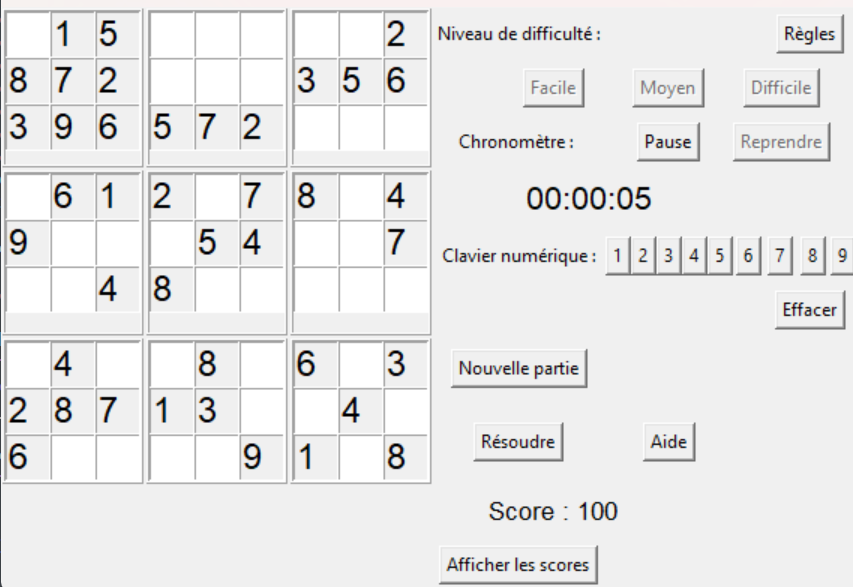

## Introduction



## I) Présentation du projet
-   Exécution du code

## II) Présentation du code
1.  Quelques fonctions pour programmer le sudoku
2.  Partager le jeu / Publipostage
3. Fonction pour calculer le score

## a. Quelques fonctions pour le sudoku
La première fonction est :
```{python, echo=TRUE, eval=FALSE, message=FALSE, warning=FALSE}
def generer_grille_complete(self):
  def remplir_grille(grille):
    row, col = self.trouver_case_vide(grille)
    if row is None:
      return True
    chiffres = list(range(1, 10))
    random.shuffle(chiffres)
    for num in chiffres:
      if self.est_valide(grille, num, (row, col)):
        grille[row][col] = num
        if remplir_grille(grille):
          return True
        grille[row][col] = 0
    return False
  remplir_grille(self.grille_complete)
```


## a. Quelques fonctions pour le sudoku
La deuxième fonction est :
```{python, echo=TRUE, eval=FALSE, message=FALSE, warning=FALSE}
def generer_grille_partielle(self, proportion):
  self.grille_partielle = [[0 for _ in range(9)] for _ in range(9)]
  for i in range(9):
    for j in range(9):
      if random.random() < proportion:
        self.grille_partielle[i][j] = self.grille_complete[i][j]
        self.cells[i][j].insert(0, str(self.grille_partielle[i][j]))
        self.cells[i][j].config(state='readonly') 
      else:
        self.grille_partielle[i][j] = 0
        self.cells[i][j].delete(0, tk.END)
        self.cells[i][j].config(state='normal') 
```

## a. Quelques fonctions pour le sudoku
La troisième fonction est : 
```{python, echo=TRUE, eval=FALSE, message=FALSE, warning=FALSE}
def generer_grille_partielle_facile(self, first_time=False):
  self.generer_grille_partielle(0.45)  # 45% de cellules pré-remplis
    if first_time:
      self.disable_level_buttons()
      self.start_chronometer()
```

## b) Partage du jeu
1er partie du code : 
```{python, echo=TRUE, eval=FALSE, message=FALSE, warning=FALSE}
#Connexion à la messagerie
server = smtplib.SMTP_SSL('smtp.gmail.com', 465)
server.login("sudoku.python@gmail.com", "eaqh niof dvqv qjih")

#Création du message
expediteur = 'sudoku.python@gmail.com'
objet = 'Sudoku'
corps_message = "Texte"
message = MIMEMultipart()
message['From'] = expediteur
message['Subject'] = objet
message.attach(MIMEText(corps_message, 'plain'))
```

## b) Partage du jeu
2nd partie du code : 
```{python, echo=TRUE, eval=FALSE, message=FALSE, warning=FALSE}
#Ajout pièce jointe
chemin_piece_jointe = 'C:/Users/annes/Downloads/pj_test.py'
nom_piece_jointe = "Sudoku.py"
message.attach(piece_jointe_mime)

#Envoi
server.sendmail(expediteur, ["xxxxx@etu.unistra.fr", "xxxx@etu.unistra.fr"], message.as_string())

#Déconnexion
server.quit()
```

## c) Collecte des scores
```{python, echo=TRUE, eval=FALSE, message=FALSE, warning=FALSE}
#fichier texte pour stocker les scores
with open('scores.txt', 'r') as file:
  scores = [line.strip() for line in file.readlines()]
  print(scores)

#tri pour classer les scores                
def triD(elem):
  if len(elem) < 4:
    return -100
    
  elem = elem[-4:]
    
  if elem[0] == '-':
    if elem[1] == ' ':
      elem = elem[2:]
    else:
      return -100
            
  return int(elem)
```
